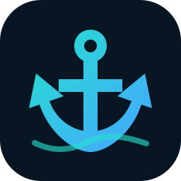

<p align="center"></p>
<h1 align="center">NZBHarbor</h1>
<p align="center"><strong>A Docker-first, open-source NZB/Usenet downloader with a SABnzbd-compatible API.</strong></p>

> **Status:** v0.1 development release. The core download path works, but NZBHarbor is still young. Test it alongside your existing downloader before trusting important automation.

## Why NZBHarbor?

NZBHarbor is being built around three goals: a simple self-hosted UI, useful failure diagnostics, and compatibility with Sonarr/Radarr without requiring Servarr to add a new download-client type.

### Included in v0.1

- Docker-first Go application
- NZB XML parsing and persistent queue/history
- TLS/plain NNTP authentication and article fetching
- yEnc decoding and multipart file assembly
- Multiple Usenet providers with priority/fill fallback
- Resume queue after container restart
- PAR2 repair and RAR extraction in the Docker image
- Responsive web dashboard
- Provider connection test
- API-key authentication
- Native REST API
- SABnzbd-compatible `version`, `get_config`, `fullstatus`, `addfile`, `queue`, `history`, `retry`, pause/resume/delete operations
- `tv`, `movies`, `music`, and `default` categories
- Sonarr/Radarr-compatible queue/history category filtering
- Docker health check
- amd64/arm64 container release workflow
- GitHub Pages documentation workflow

## Quick start

```bash
git clone https://github.com/kasundigital/NZBHarbor.git
cd NZBHarbor
docker compose up -d --build
```

Open:

```text
http://YOUR-SERVER-IP:6789
```

On first start NZBHarbor generates an API key. Read it with:

```bash
cat config/config.json
```

Enter that key when the web UI asks for it, then open **Servers**, add your Usenet provider, and press **Test**.

### Useful Docker commands

```bash
# Follow logs
docker logs -f nzbharbor

# Status
docker compose ps

# Restart
docker compose restart nzbharbor

# Rebuild after an update
git pull
docker compose up -d --build

# Stop
docker compose down
```

## Recommended media-stack paths

For Sonarr/Radarr, make sure both NZBHarbor and the Servarr app can see completed downloads through compatible paths. A shared `/data` layout is recommended in a larger Compose stack, for example:

```yaml
volumes:
  - /srv/media-data:/data
```

Then configure NZBHarbor downloads under `/data/downloads` and give Sonarr/Radarr the same `/data` mount. This reduces remote path mapping problems.

## Sonarr / Radarr

NZBHarbor presents a SABnzbd-compatible API, so in Sonarr/Radarr choose **SABnzbd** as the download client.

When all containers are on the same Docker network:

```text
Host: nzbharbor
Port: 6789
SSL: No (use HTTPS at your reverse proxy if needed)
API Key: <NZBHarbor API key>
Category in Sonarr: tv
Category in Radarr: movies
```

Do **not** use `localhost` from inside the Sonarr/Radarr container; it refers to that container itself.

See [Sonarr & Radarr setup](docs/guides/SONARR-RADARR.md).

## Files and persistence

```text
/config/config.json       Settings and provider credentials
/config/state.json        Persistent jobs/history
/config/nzbs/             Saved NZB metadata
/downloads/incomplete/    Temporary article segments
/downloads/complete/      Completed downloads
```

Back up `/config`. Protect it: `config.json` contains your Usenet password and API key.

## API

Health does not require authentication:

```bash
curl http://localhost:6789/api/v1/health
```

Native API requests use:

```text
X-Api-Key: YOUR_KEY
```

SAB-compatible requests use the usual `apikey` query parameter. See [API reference](docs/guides/API.md).

## Troubleshooting

Start here:

```bash
docker compose ps
docker logs --tail=200 nzbharbor
curl http://127.0.0.1:6789/api/v1/health
```

Common causes are wrong NNTP TLS/port settings, provider authentication, missing articles, inconsistent Docker paths, permissions, or an incorrect API key. The full checklist is in [Troubleshooting](docs/guides/TROUBLESHOOTING.md).

## Security

- Keep port `6789` on your LAN/private Docker network where possible.
- For Internet access, use an authenticated HTTPS reverse proxy or VPN.
- Never publish `/config/config.json`.
- Rotate the API key/provider password if exposed.

## Current limitations

v0.1 prioritizes correctness and inspectability over peak speed. It currently opens an NNTP connection per article instead of maintaining a reusable connection pool. Connection pooling, article CRC validation, richer PAR/RAR edge-case handling, bandwidth scheduling, richer diagnostics, notifications, and packaging for other platforms are planned.

See [ROADMAP.md](ROADMAP.md).

## Development

Requires Go 1.23+.

```bash
go test ./...
go vet ./...
go run ./cmd/nzbharbor
```

For local development, point runtime directories somewhere writable:

```bash
NZBHARBOR_CONFIG="$PWD/config" \
NZBHARBOR_DOWNLOADS="$PWD/downloads" \
NZBHARBOR_WEB="$PWD/web" \
go run ./cmd/nzbharbor
```

## License

MIT. See [LICENSE](LICENSE).

---

Built by [Kasun Indika](https://www.kasunindika.com).
